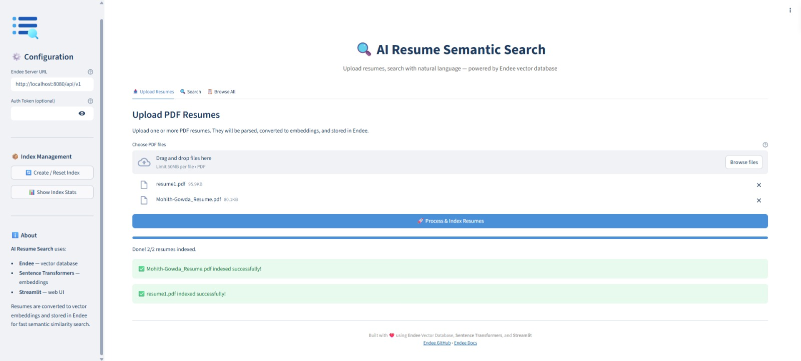
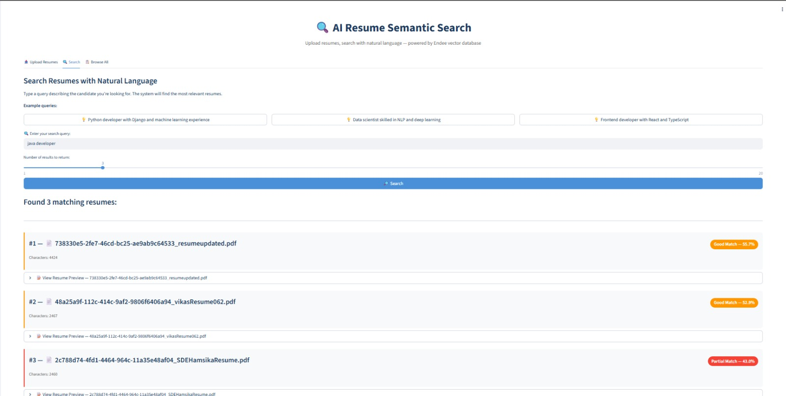
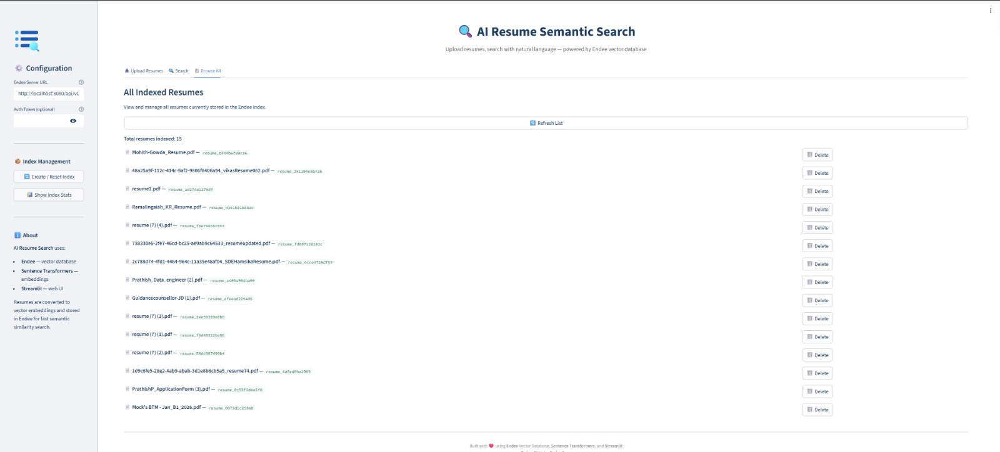

# 🔍 AI Resume Semantic Search System

A practical AI application that lets users upload PDF resumes, convert them into vector embeddings, store them in **[Endee](https://github.com/endee-io/endee)** vector database, and perform semantic search using natural language queries.

> **Example Query:** *"Python developer with Django and machine learning experience"*
> → Returns the most relevant resumes ranked by semantic similarity.

---

## 📌 Table of Contents

- [Overview](#-overview)
- [System Design](#-system-design)
- [Tech Stack](#-tech-stack)
- [Project Structure](#-project-structure)
- [Setup & Installation](#-setup--installation)
- [Usage Guide](#-usage-guide)
- [How It Works (Step-by-Step)](#-how-it-works-step-by-step)
- [API & Code Walkthrough](#-api--code-walkthrough)
- [Screenshots](#-screenshots)
- [Future Enhancements](#-future-enhancements)
- [License](#-license)

---

## 🧠 Overview

Traditional resume search relies on exact keyword matching — if a recruiter searches for "ML engineer," resumes using "machine learning specialist" won't appear. **Semantic search solves this** by understanding the *meaning* behind text.

This project demonstrates a real-world use case of vector databases by:
1. **Parsing** PDF resumes to extract text
2. **Embedding** the text into 384-dimensional vectors using a Sentence Transformer model
3. **Storing** vectors in Endee (a high-performance vector database)
4. **Searching** using natural language queries — Endee finds the closest vectors using cosine similarity

---

## 🏗 System Design

### Architecture Diagram

```
┌─────────────────────────────────────────────────────────────────┐
│                        STREAMLIT UI                             │
│  ┌──────────────┐  ┌──────────────┐  ┌───────────────────────┐  │
│  │ Upload Tab   │  │ Search Tab   │  │ Browse Tab            │  │
│  │ (PDF Upload) │  │ (NL Query)   │  │ (View/Delete Resumes) │  │
│  └──────┬───────┘  └──────┬───────┘  └───────────┬───────────┘  │
│         │                 │                       │              │
└─────────┼─────────────────┼───────────────────────┼──────────────┘
          │                 │                       │
          ▼                 ▼                       │
  ┌───────────────┐  ┌───────────────┐              │
  │  PDF Parser   │  │  Embedding    │              │
  │  (PyPDF2)     │  │  Generator    │              │
  │               │  │  (Sentence    │              │
  │  PDF → Text   │  │  Transformers)│              │
  └───────┬───────┘  └───────┬───────┘              │
          │                 │                       │
          ▼                 ▼                       ▼
  ┌─────────────────────────────────────────────────────────────┐
  │                    ENDEE CLIENT MODULE                      │
  │                                                             │
  │  create_index() │ upsert() │ query() │ delete() │ list()   │
  └─────────────────────────────┬───────────────────────────────┘
                                │
                                ▼
                  ┌──────────────────────────┐
                  │    ENDEE VECTOR DATABASE  │
                  │    (Docker Container)     │
                  │                          │
                  │  Index: "resumes"         │
                  │  Dimension: 384           │
                  │  Metric: Cosine           │
                  │  Precision: FLOAT32       │
                  └──────────────────────────┘
```

### Data Flow

**Ingestion Pipeline (Upload):**
```
PDF File → PyPDF2 (extract text) → Sentence Transformer (text → 384-dim vector) → Endee (store vector + metadata)
```

**Search Pipeline (Query):**
```
Natural Language Query → Sentence Transformer (query → 384-dim vector) → Endee (cosine similarity search) → Top-K Results
```

### Why This Design?

| Decision | Reasoning |
|---|---|
| **Endee** as vector DB | High-performance, handles up to 1B vectors, simple REST API, Python SDK available |
| **all-MiniLM-L6-v2** model | 384-dim embeddings, fast inference, good semantic quality, runs on CPU |
| **Cosine similarity** | Best for comparing text embeddings (direction matters, not magnitude) |
| **Streamlit** for UI | Rapid prototyping, built-in file upload, no frontend code needed |

---

## 🛠 Tech Stack

| Component | Technology | Purpose |
|---|---|---|
| **Vector Database** | [Endee](https://github.com/endee-io/endee) | Store and search resume embeddings |
| **Embedding Model** | [all-MiniLM-L6-v2](https://huggingface.co/sentence-transformers/all-MiniLM-L6-v2) | Convert text to 384-dim vectors |
| **PDF Parsing** | PyPDF2 | Extract text from uploaded PDFs |
| **Web UI** | Streamlit | Interactive user interface |
| **Language** | Python 3.9+ | Backend logic |
| **Container** | Docker | Run Endee server |

---

## 📁 Project Structure

```
resume-search-ai/
│
├── app.py                  # Main Streamlit application (UI + orchestration)
├── pdf_parser.py           # PDF text extraction module
├── embeddings.py           # Sentence Transformer embedding generation
├── endee_client.py         # Endee vector database operations
├── requirements.txt        # Python dependencies
├── docker-compose.yml      # Docker config to run Endee server
├── .gitignore              # Git ignore rules
├── .streamlit/
│   └── config.toml         # Streamlit theme configuration
├── sample_resumes/         # (Optional) Sample PDF resumes for testing
└── README.md               # This file
```

### Module Responsibilities

| File | What it does |
|---|---|
| `app.py` | Streamlit UI with 3 tabs: Upload, Search, Browse. Orchestrates the full pipeline. |
| `pdf_parser.py` | Takes a PDF file, extracts text from all pages, cleans it up. |
| `embeddings.py` | Loads the AI model, converts text strings into 384-dimensional vectors. |
| `endee_client.py` | All Endee operations — create index, insert vectors, search, delete. |

---

## 🚀 Setup & Installation

### Prerequisites

- **Python 3.9+** installed
- **Docker** installed and running (for the Endee server)
- **Git** installed

### Step 1: Clone the Repository

```bash
git clone https://github.com/<your-username>/resume-search-ai.git
cd resume-search-ai
```

### Step 2: Create a Virtual Environment

```bash
# Create virtual environment
python -m venv venv

# Activate it
# On macOS/Linux:
source venv/bin/activate
# On Windows:
venv\Scripts\activate
```

### Step 3: Install Python Dependencies

```bash
pip install -r requirements.txt
```

> **Note:** The first time you run the app, it will download the Sentence Transformer model (~80 MB). This happens automatically.

### Step 4: Start the Endee Vector Database

```bash
# Start Endee in the background
docker compose up -d

# Verify it's running
docker ps
# You should see "endee-server" container running on port 8080
```

You can also verify by opening http://localhost:8080 in your browser — you should see the Endee dashboard.

### Step 5: Run the Application

```bash
streamlit run app.py
```

The app will open in your browser at **http://localhost:8501**.

---

## 📖 Usage Guide

### 1. Create the Index

Before uploading resumes, you need to create the vector index in Endee:
- In the **sidebar**, click **"🔄 Create / Reset Index"**
- You should see a success message

### 2. Upload Resumes

- Go to the **"📤 Upload Resumes"** tab
- Upload one or more PDF resumes
- Click **"🚀 Process & Index Resumes"**
- Each resume is parsed, embedded, and stored in Endee

### 3. Search

- Go to the **"🔍 Search"** tab
- Type a natural language query like: *"Python developer with Django and machine learning experience"*
- Click **"🔎 Search"**
- Results are ranked by semantic similarity (higher % = better match)

### 4. Browse & Manage

- Go to the **"📋 Browse All"** tab to see all indexed resumes
- Delete individual resumes if needed

---

## 🔬 How It Works (Step-by-Step)

### The Embedding Process

When you upload a resume, here's exactly what happens:

```python
# 1. Extract text from PDF
text = extract_text_from_pdf(uploaded_file)
# Result: "John Doe | Python Developer | Experience: 5 years at Google..."

# 2. Convert text to a vector (embedding)
embedding = generate_embedding(model, text)
# Result: [0.0234, -0.0891, 0.1245, ..., 0.0567]  (384 numbers)

# 3. Store in Endee with metadata
upsert_resume(url, token, "resume_abc123", embedding, metadata)
# Endee now has this vector indexed for fast similarity search
```

### The Search Process

When you search for "Python developer with ML experience":

```python
# 1. Convert query to a vector (same model, same vector space)
query_vec = generate_embedding(model, "Python developer with ML experience")
# Result: [0.0198, -0.0754, 0.1189, ..., 0.0612]  (384 numbers)

# 2. Endee compares this vector against ALL stored resume vectors
#    using cosine similarity (dot product of normalized vectors)
results = search_resumes(url, token, query_vec, top_k=5)

# 3. Returns top 5 most similar resumes with similarity scores
# [
#   {"id": "resume_abc123", "similarity": 0.85, "meta": {...}},
#   {"id": "resume_def456", "similarity": 0.72, "meta": {...}},
#   ...
# ]
```

### Why It's "Semantic"

Traditional keyword search for "ML engineer" would **miss** resumes that say:
- "Machine Learning specialist"
- "AI/Deep Learning researcher"
- "Data scientist with neural network expertise"

Semantic search understands these all mean similar things because the embedding model learned from billions of text examples that these phrases are semantically close.

---

## 🔧 API & Code Walkthrough

### Endee SDK Usage

This project uses the [Endee Python SDK](https://docs.endee.io/python-sdk/quickstart). Key operations:

```python
from endee import Endee, Precision

# Connect to Endee
client = Endee()
client.set_base_url("http://localhost:8080/api/v1")

# Create an index (like creating a table)
client.create_index(
    name="resumes",
    dimension=384,           # Must match embedding model output
    space_type="cosine",     # Similarity metric
    precision=Precision.FLOAT32
)

# Get reference to the index
index = client.get_index(name="resumes")

# Insert a vector
index.upsert([{
    "id": "resume_001",
    "vector": [0.1, 0.2, ...],   # 384 floats
    "meta": {"filename": "john_doe.pdf", "text_preview": "..."}
}])

# Search for similar vectors
results = index.query(vector=[0.15, 0.25, ...], top_k=5)
```

### Key Configuration

| Parameter | Value | Why |
|---|---|---|
| `dimension` | 384 | Matches `all-MiniLM-L6-v2` output size |
| `space_type` | cosine | Best for text embedding similarity |
| `precision` | FLOAT32 | Full precision for accuracy |
| `top_k` | 5 (default) | Number of search results to return |

---


## 📸 Screenshots

### 📤 Upload Resumes

<p align="center">
  
</p>

### 🔍 Search Results

<p align="center">
  
</p>

### 📊 Endee Dashboard

<p align="center">
  
</p>

---

## 🚀 Future Enhancements

- **RAG Integration**: Add an LLM (OpenAI/Ollama) to generate natural language summaries of matching candidates
- **Skill Extraction**: Use NER to extract specific skills and store them as Endee filters
- **Batch Upload**: Support ZIP file uploads containing multiple resumes
- **Advanced Filters**: Filter by experience years, location, or skills using Endee's filter feature
- **Hybrid Search**: Combine dense + sparse vectors for better keyword + semantic matching
- **Resume Comparison**: Compare two resumes side-by-side with similarity scoring

---

## 📝 License

This project is open source under the [MIT License](LICENSE).

**Endee** is licensed under [Apache License 2.0](https://github.com/endee-io/endee/blob/master/LICENSE).

---

## 🙏 Acknowledgments

- [Endee](https://github.com/endee-io/endee) — High-performance vector database
- [Sentence Transformers](https://www.sbert.net/) — State-of-the-art text embeddings
- [Streamlit](https://streamlit.io/) — Rapid web app framework for ML projects
- [PyPDF2](https://pypdf2.readthedocs.io/) — PDF text extraction

---

<p align="center">
  Built with ❤️ for the AI/ML Assignment Project<br/>
  Powered by <strong>Endee Vector Database</strong>
</p>
